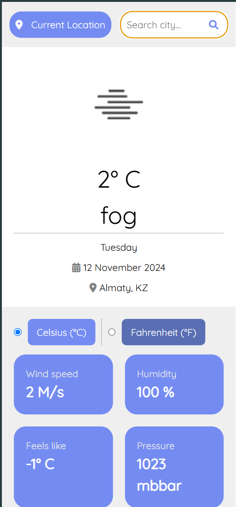

# Weather App

A simple web application that provides real-time weather information, including current conditions and a 5-day forecast.
The app uses the OpenWeatherMap API to retrieve weather data based on user input or the user's current location.
The application also supports toggling between Celsius and Fahrenheit for temperature display.

## Features

### 1. Search Functionality
- **City Search**: Users can search for weather information by entering a city name.
- **Auto-suggest**: As the user types a city name, suggestions appear to help with quicker and more accurate searches.

### 2. Current Weather Display
- **Temperature**: Shows the current temperature.
- **Weather Details**: Displays additional information, including humidity, wind speed, and weather conditions (e.g., sunny, rainy).
- **Weather Icon**: Includes an icon to represent the current weather condition visually.

### 3. 5-Day Forecast
- **Daily Forecast**: Below the current weather, users can view the weather forecast for the next 5 days.
- **Forecast Details**: Each day’s forecast includes high and low temperatures, weather conditions, and an icon representing the expected weather.

### 4. Location Feature
- **Geolocation**: Option for users to get weather data for their current location using the device's geolocation feature.

### 5. Unit Toggle
- **Temperature Unit Toggle**: Users can switch between Celsius and Fahrenheit for temperature display.

## API
- **OpenWeatherMap API**: This app uses the OpenWeatherMap API to fetch weather data. Please ensure you have an API key from OpenWeatherMap to access the weather data.

## Getting Started

1. **Clone the Repository**: Start by cloning the repository to your local machine:
   ```bash
   git clone https://github.com/toybayev/midterm2-Frontend.git

2. **Open Folder WeatherApp**

3. **Run index.html**


## Screenshots

### Desktop version


### Mobile version




#Recipe App

A web application that allows users to search for recipes based on ingredients or dish names, view detailed recipe information, and save favorites for easy access later. The app uses the Spoonacular Recipe API to retrieve recipe data.

##Features
###1. Search Functionality
Ingredient and Dish Search: Users can search for recipes by entering ingredients or dish names.
Auto-suggest: As the user types, suggestions for recipe names appear to assist in faster and more accurate searches.
###2. Display Recipes
Recipe Grid Layout: Displays recipes in a grid layout with images, names, and preparation times.
Recipe Card Details: Each recipe card includes a short description of the dish.
###3. Recipe Details Page
Detailed View: Clicking a recipe opens a modal or new section with:
Ingredients: Shows ingredients with quantities.
Instructions: Step-by-step cooking instructions.
Nutritional Information: Displays calories, protein, fat, and other nutritional values.
User Ratings and Reviews: Optionally shows user ratings and reviews.
###4. Favorites Feature
Save to Favorites: Users can save recipes to a "Favorites" list for quick access.
Persistent Storage: Favorites are saved in local storage, allowing recipes to remain saved even after page refreshes.

###API
Spoonacular Recipe API: This app uses the Spoonacular Recipe API to fetch recipe data. Please ensure you have an API key from Spoonacular to access the recipe data.


## Getting Started

1. **Clone the Repository**: Start by cloning the repository to your local machine:
   ```bash
   git clone https://github.com/toybayev/midterm2-Frontend.git

2. **Open Folder WeatherApp**

3. **Run index.html**


## Screenshots

### Desktop version


### Mobile version


#Movies App


A web application that allows users to search for movies, view details, and create a personal watchlist for future viewing. The app uses TheMovieDatabase (TMDb) API to retrieve movie data, including details like cast, crew, and trailers.

##Features
1. Search Functionality
Movie Search: Users can search for movies by entering the title of the movie.
Auto-suggest: As the user types, suggestions appear to aid in faster and more accurate searches.
2. Display Movies
Grid Layout: Displays movies in a grid format, showcasing movie posters, titles, and release dates.
Sorting Options: Users can sort movies by popularity, release date, or rating to personalize their browsing experience.
3. Movie Details Page
Detailed View: Clicking on a movie opens a modal or a new section with comprehensive information, including:
Synopsis: Overview of the movie plot.
Rating and Runtime: Shows the movie rating and length.
Cast and Crew: Displays information about key actors and crew members.
User Reviews: Optionally displays reviews from other viewers.
Trailers or Clips: If available, includes trailers or clips of the movie.
4. Watchlist Feature
Add to Watchlist: Users can add movies to a "Watchlist" for easy access and future viewing.
Persistent Storage: The watchlist is saved in local storage, allowing users to retain their selections even after refreshing the page.

##API
TheMovieDatabase (TMDb) API: This app uses the TMDb API to fetch movie data. Ensure you have an API key from TMDb to access the data.

##Getting Started

git clone https://github.com/toybayev/midterm2-Frontend.git
Open Folder MoviesApp

Run index.html to launch the app in your browser.

##Screenshots
###Desktop version


###Mobile version


